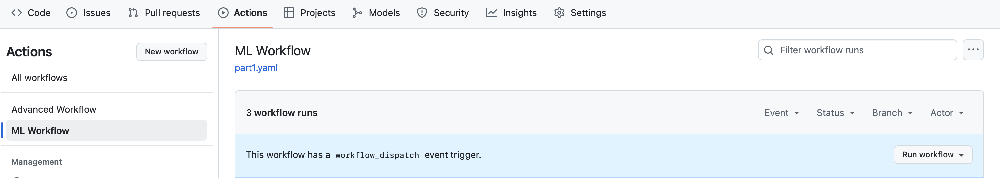
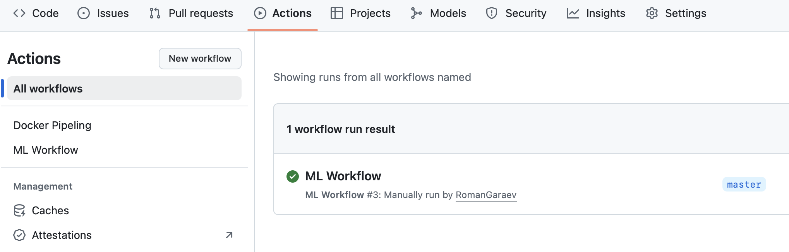

# PMLDL. Lab 04. Part 1. GitHub Actions

**No competition!**

This part of the lab is based on the [tutorial](https://www.kdnuggets.com/github-actions-for-machine-learning-beginners) by Abid Ali Awan
## 1. What is GitHub Actions?

GitHub Actions is a tool that lets you automate building, testing, and deploying your code whenever you push changes to your repository. Such tool  

GitHub Actions is available for free in private repositories. The one can set the **workflow** of Actions in ***.github/workflows*** directory using YAML config file.

A typical CI workflow for this project will:

- Check out your code.
- Set up Python and install dependencies.
- Optionally, run tests or lint your code.
- Generate and upload reports (for example, using model artifacts).

Before starting the coding, let's review some key concepts of GitHub Actions.

#### 1.1 Workflows
Workflows are automated processes that you define in your GitHub repository. They are composed of one or more jobs and can be triggered by GitHub events such as a push, pull request, issue creation, or by workflows. Workflows are defined in a YML file within the .github/workflows directory of your repository. You can edit it and rerun the workflow right from the GitHub repository. 

#### 1.2 Jobs and Steps
Within a workflow, jobs define a set of steps that execute on the same runner. Each step in a job can run commands or actions, which are reusable pieces of code that can perform a specific task, such as formatting the code or training the model.

#### 1.3 Events
Workflows can be triggered by various GitHub events, such as push, pull requests, forks, stars, releases, and more. You can also schedule workflows to run at specific times using cron syntax.

#### 1.4 Runners
Runners are the virtual environments/machines where workflows are executed. GitHub provides hosted runners with Linux, Windows, and macOS environments, or you can host your own runner for more control over the environment.

#### 1.5 Actions
Actions are reusable units of code that you can use as steps within your jobs. You can create your own actions or use actions shared by the GitHub community in the GitHub Marketplace.

GitHub Actions makes it straightforward for developers to automate their build, test, and deployment workflows directly within GitHub, helping to improve productivity and streamline the development process. Here we will use two Actions:

- **actions/checkout@v3**: for checking out your repository so that workflow can access the file and data.
- **iterative/setup-cml@v2**: for displaying the model metrics and confusion matrix under the commit as a message. 

## 2. Training

We wouldn't focus on training itself on this lab, please just review **train.py**. After that, answer the following questions:

1) What dataset is used in the training?
2) Why do we use Pipelines? 
3) What's the puprose of skops.io lib? What alternatives do you know?

## 3. Configuring GitHub Actions

We will develop a machine learning workflow for training and evaluating our model. This workflow will be activated whenever we push our code to the main branch or when someone submits a pull request to the main branch.

The Workflow is defined in the **.github/workflows/part1.yml** file. Let's review its content step-by-step. The file contains the following:

1) Naming our workflow.
2) Setting the triggers on push and pull request using `on` keyworks. 
3) Providing the actions with written permission so that the [CML action](https://github.com/iterative/setup-cml) can create the message under the commit.
4) Use Ubuntu Linux runner.
5) Use `actions/checkout@v3` action to access all the repository files, including the dataset. 
6) Using `iterative/setup-cml@v2` action to install the CML package. 
7) Create the run for installing all of the Python packages.
8) Create the run for formatting the Python files.
9) Create the run for training and evaluating the model.
10) Create the run with `GITHUB_TOKEN` for moving the model metrics and confusion matrix plot to report.md file. Then, use the CML command to create the report under the commit comment.

We're ready to submit the workflow. 
**Task**. Create an empty private repository, configure Actions,copy the content of this lab to it (both parts as they are) and push. 
Go to the GitHub repo page to chech the workflows. You should see two of them (`Advanced Workflow` corresponds to the part 2 of the lab). Press `Run workflow` for the first one and check the status.

If everything is OK, you should see smth like this:

Try to find the report in the Actions!

### Potential problems

In the last step we do commit from actions to our repository. With that you may observe problems with permissions. To fix that, visit Settings > General and scroll down to "Workflow permissions". Pick "Read and write permissions".
